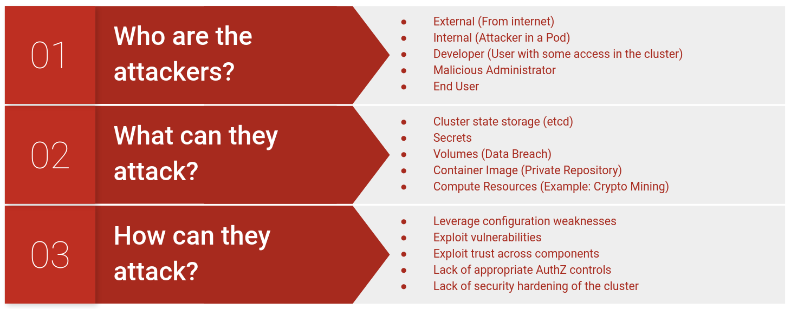

# Threat Modelling

> Threat modelling works to identify, communicate, and understand threats and mitigations within the context of protecting something of value.

Kubernetes is a complex, distributed system with multiple components. In order to perform an effective security testing, it is important to understand how different components interacts with each other and answer questions such as

1. Who are the attackers?
2. What can they attack?
3. How can they attack?

We will present a high-level threat model in this document, which in turn will drive the different chapters in this document. The objective is to allow a tester to chose what is applicable and what is not based on the threat model and the level of access available to the tester.

A simple threat model is presented below as an example. The intention is to get testers started with thinking in terms of a threat model. The threat model is further expanded in subsequent chapters.

A detailed threat model is already developed as part of a [security audit](https://github.com/kubernetes/community/tree/master/wg-security-audit) conducted by [Trail of Bits](https://www.trailofbits.com/) along with [Kubernetes Security Audit Working Group](https://github.com/kubernetes/community/tree/master/wg-security-audit). We refer to this threat model as required to conduct an effective security testing of a Kubernetes cluster.

## References

* https://github.com/kubernetes/community/tree/master/wg-security-audit
* https://owasp.org/www-community/Application_Threat_Modeling
* https://infosec.mozilla.org/guidelines/risk/rapid_risk_assessment.html
